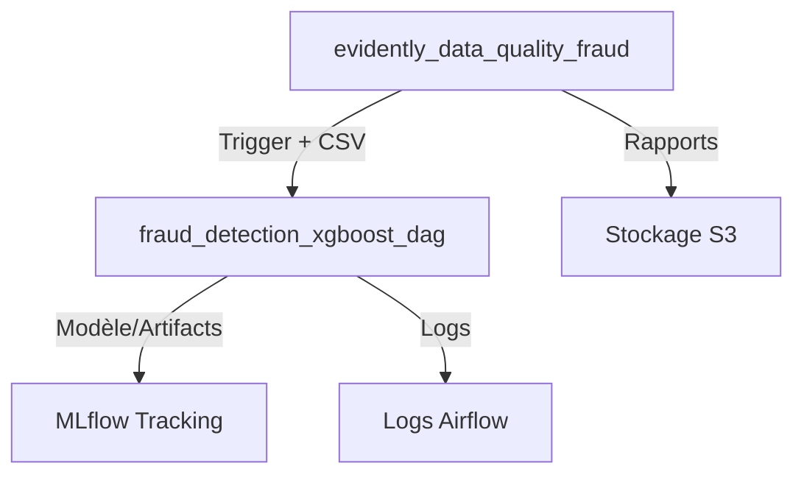

# Pipeline de Détection de Fraude avec Airflow, XGBoost et MLflow

Ce projet implémente un **pipeline automatisé de détection de fraude** en deux étapes :
1. **Vérification de la qualité des données** (Drift, tests statistiques) avec Evidently.
2. **Entraînement d'un modèle XGBoost** et suivi des expériences avec MLflow.

Le pipeline est orchestré avec **Apache Airflow**, et les artefacts sont stockés sur S3.

---

## 📌 Architecture Globale


```mermaid
graph TD
    A[evidently_data_quality_fraud] -->|Trigger + CSV| B[fraud_detection_xgboost_dag]
    A -->|Rapports| S3[Stockage S3]
    B -->|Modèle/Artifacts| MLflow[MLflow Tracking]
    B -->|Logs| Airflow[Logs Airflow]

```


## 📂 Structure du Projet

```
.
├── dags/
│   ├── evidently_data_quality_fraud.py      # DAG 1 : Vérification qualité des données
│   └── fraud_detection_xgboost_dag.py       # DAG 2 : Entraînement XGBoost
├── data/                                    # Dossier local pour les données (monté dans Airflow)
├── reports/                                 # Rapports Evidently (Drift, Test Suite)
└── README.md

```

## 1️⃣ DAG evidently_data_quality_fraud

Objectif : Vérifier la qualité des données avant l'entraînement.
Fonctionnalités :

- download_fraud_csv : Télécharge le dataset fraudTest.csv depuis une URL.
- evidently_check : Génère un rapport de drift (visuel) et une test suite (textuelle) avec Evidently.
- upload_reports_to_s3 : Sauvegarde les rapports en local et sur S3.
- send_evidently_report_email : Envoie un email de résumé avec les liens vers les rapports.
- trigger_xgboost_dag : Déclenche le DAG suivant (fraud_detection_xgboost_dag) en passant le chemin du fichier CSV.

## 2️⃣ DAG fraud_detection_xgboost_dag
Objectif : Entraîner un modèle XGBoost pour détecter les fraudes.
Fonctionnalités :

- get_data : Récupère le chemin du fichier CSV passé par le DAG précédent (dag_run.conf).
- clean_data : Nettoie les données (feature engineering, encodage, etc.).
- train_model : Entraîne un modèle XGBoost avec suivi des métriques via MLflow. Sauvegarde la matrice de confusion et log le modèle.

## Variable #Airflow

Variable,Description
- AWS_ACCESS_KEY_ID,Clé AWS pour accéder à S3.
- AWS_SECRET_ACCESS_KEY,Secret AWS.
- BUCKET,Nom du bucket S3 pour les rapports.
- ARTIFACT_STORE_URI,URI du stockage MLflow.
- BACKEND_STORE_URI_FP,URI du backend MLflow.

## 🔧 Comment Lancer le Pipeline ?
1. Déployer les DAGs

Copier les fichiers .py dans le dossier dags/ d'Airflow.
Activer les DAGs dans l'UI Airflow.

2. Exécuter manuellement (optionnel)

Dans l'UI Airflow, cliquer sur Trigger DAG pour evidently_data_quality_fraud.
Le DAG XGBoost sera déclenché automatiquement.

3. Vérifier les résultats

Rapports : Voir les emails envoyés ou les fichiers dans le bucket S3.
Modèle : Consulter l'expérience MLflow à l'URL configurée.


⚠️ Points d'Attention

- Dépendances : Vérifier que toutes les librairies sont installées dans l'environnement Airflow.
- Permissions S3 : Le rôle IAM doit avoir les droits s3:PutObject et s3:GetObject.
- MLflow : L'URI du tracking doit être accessible depuis Airflow.
- Chemin des fichiers : Le dossier /opt/airflow/data doit être monté et accessible en écriture.